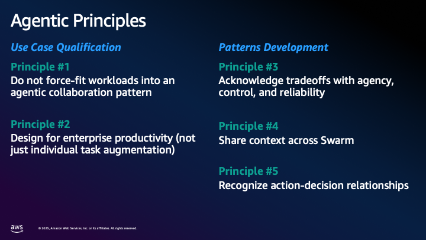

# Multi-Agent Systems for Financial Services
## A Self-Study Guide to Agentic AI Architecture Development

*This work is a derivative of original research and principles developed for the broader financial services technical community. We acknowledge and credit the original author's foundational work, Alfredo Castillo, Sr Solutions Architect – FSI GenAI at AWS, in multi-agent system design principles.*

---

## Table of Contents

- [Introduction to Agentic AI and Multi-Agent Systems](#introduction-to-agentic-ai-and-multi-agent-systems)
  - [What Are Agentic AI Systems?](#what-are-agentic-ai-systems)
  - [The Evolution to Multi-Agent Architectures](#the-evolution-to-multi-agent-architectures)
    - [Limitations of Single AI Agents](#limitations-of-single-ai-agents)
    - [Multi-Agent Systems: Overcoming Single Agent Limitations](#multi-agent-systems-overcoming-single-agent-limitations)
  - [Applications in Financial Services](#applications-in-financial-services)
  - [Agent-to-Agent Protocol (A2A) with AWS Strands Agents](#agent-to-agent-protocol-a2a-with-aws-strands-agents)
- [Multi-Agent Coordination Patterns](#multi-agent-coordination-patterns)
  - [1. Sequential Workflow Patterns](#1-sequential-workflow-patterns)
  - [2. Hierarchical Graph Patterns (Star Pattern)](#2-hierarchical-graph-patterns-star-pattern)
  - [3. Swarm Patterns: Mesh](#3-swarm-patterns-mesh)
  - [4. Swarm Patterns: Parallel](#4-swarm-patterns-parallel)
  - [5. Loop and Composite Patterns](#5-loop-and-composite-patterns)
  - [When to Choose Each Pattern](#when-to-choose-each-pattern)
- [Core Design Principles - Quick Reference](#core-design-principles---quick-reference)
- [Enterprise Design Principles](#enterprise-design-principles)
  - [From Prototype to Production](#from-prototype-to-production)
  - [Principle #1: Workflow-First Design](#principle-1-workflow-first-design)
  - [Principle #2: Enterprise Productivity Focus](#principle-2-enterprise-productivity-focus)
  - [Principle #3: Balance Agency, Control, and Reliability](#principle-3-balance-agency-control-and-reliability)
  - [Principle #4: Comprehensive Context Sharing](#principle-4-comprehensive-context-sharing)
  - [Principle #5: Decision-Action Alignment](#principle-5-decision-action-alignment)
- [Implementation Examples](#implementation-examples)
  - [1. Autonomous Claims Adjudication System](#1-autonomous-claims-adjudication-system)
  - [2. Automated Financial Research and Analysis Platform](#2-automated-financial-research-and-analysis-platform)
  - [3. Intelligent Loan Underwriting System](#3-intelligent-loan-underwriting-system)
- [Learning Path: A Progressive Journey Through Multi-Agent Systems](#learning-path-a-progressive-journey-through-multi-agent-systems)
  - [Phase 1: Foundational Understanding](#phase-1-foundational-understanding)
  - [Phase 2: Single Agent Mastery](#phase-2-single-agent-mastery)
  - [Phase 3: Multi-Agent Coordination](#phase-3-multi-agent-coordination)
  - [Phase 4: Enterprise-Scale Systems](#phase-4-enterprise-scale-systems)
  - [Files That Build Upon Each Other](#files-that-build-upon-each-other)
- [Setup Requirements & Installation](#setup-requirements--installation)
  - [Prerequisites](#prerequisites)
  - [System Compatibility](#system-compatibility)
  - [Required Environment Variables](#required-environment-variables)
  - [AWS Bedrock Model Access (CRITICAL)](#aws-bedrock-model-access-critical)
  - [Installation Steps](#installation-steps)
  - [Running the 5 Multi-Agent Demos](#running-the-5-multi-agent-demos)
  - [Troubleshooting Common Issues](#troubleshooting-common-issues)
- [Additional Learning Resources](#additional-learning-resources)
  - [Academic Papers](#academic-papers)
  - [Industry Reports](#industry-reports)
  - [Online Resources](#online-resources)

---

## Introduction to Agentic AI and Multi-Agent Systems

### What Are Agentic AI Systems?

Agentic AI represents a paradigm shift from traditional AI systems that simply respond to queries toward autonomous systems capable of independent reasoning, planning, and action-taking. Unlike conventional AI models that provide static responses, agentic systems can pursue goals, make decisions, and adapt their strategies based on environmental feedback ([Yudkowsky, 2008](https://intelligence.org/files/AIPosNegFactor.pdf); [Russell & Norvig, 2020](https://www.amazon.com/Artificial-Intelligence-A-Modern-Approach/dp/0134610997)).

The evolution of AI systems demonstrates increasing autonomy and business impact across four stages:

- **Generative AI Assistants**: Follow a set of rules, automate repetitive tasks (more human oversight)
- **Generative AI Agents**: Achieve singular goals, address broader range of tasks  
- **Agentic AI Systems**: Automate entire workflows, fully autonomous
- **Multi-Agent Systems**: Mimic human logic and reasoning (less human oversight)

The term "agent" in AI refers to any system that perceives its environment through sensors and acts upon that environment through actuators to achieve specified objectives ([Russell & Norvig, 2020](https://www.amazon.com/Artificial-Intelligence-A-Modern-Approach/dp/0134610997)). In the context of large language models and modern AI, agentic systems combine natural language understanding with the ability to use tools, maintain memory, and coordinate with other agents to accomplish complex tasks.

### The Evolution to Multi-Agent Architectures

Multi-agent systems (MAS) emerged from the recognition that complex real-world problems often exceed the capabilities of any single intelligent agent ([Stone & Veloso, 2000](https://www.cs.cmu.edu/~mmv/papers/MASsurvey.pdf); [Wooldridge, 2009](https://www.wiley.com/en-be/An+Introduction+to+MultiAgent+Systems%2C+2nd+Edition-p-9780470519462)). 

#### Limitations of Single AI Agents

Single agents can start small and manageable, but as they scale to handle enterprise requirements, several critical limitations emerge:

**Technical Challenges:**
- **Coding Complexity**: Complex prompts required to limit hallucinations
- **Fragility**: Hard to maintain as systems grow
- **Tool Confusion**: Agents call wrong tools or pass incorrect arguments
- **Inconsistent Responses**: Reliability decreases with complexity

**Performance Issues:**
- **Slower Operation**: Frontier models needed for complex tasks
- **Increased Costs**: Prompt sizes grow exponentially  
- **Retry Overhead**: Agents frequently retry failed steps
- **Context Window Limits**: Context degradation syndrome

**Architectural Limitations:**
- **Lack of Collaboration**: No distributed problem solving capability
- **Single Task Execution**: No parallel task processing
- **No Specialization**: Single agent must handle all domains


#### Multi-Agent Systems: Overcoming Single Agent Limitations

By distributing cognitive load across multiple specialized agents, multi-agent systems achieve several key advantages:

- **Domain-Specific Expertise**: Specialized agents optimized for specific functions ([Jennings, 2000](https://www.researchgate.net/publication/222661672_On_Agent-Based_Software_Engineering))
- **Increased Processing Speed**: Parallelization enables concurrent task execution ([Durfee & Lesser, 1991](https://www.researchgate.net/publication/2589926_Distributed_Problem_Solving_and_Planning))
- **Collaboration**: Agents plan and execute complex tasks together
- **Reduced Hallucination**: Cross-verification between agents improves accuracy
- **Extended Context Window**: Distributed memory and knowledge sharing
- **Fault Tolerance**: System resilience when individual agents fail ([Tambe, 1997](https://jair.org/index.php/jair/article/view/10193))
- **Emergent Intelligence**: Collective behavior exceeds individual capabilities ([Holland, 1992](https://direct.mit.edu/books/monograph/2574/Adaptation-in-Natural-and-Artificial-SystemsAn))


### Applications in Financial Services

Financial services present particularly compelling use cases for multi-agent systems due to their inherent complexity, regulatory requirements, and need for reliable automation. The industry's reliance on diverse data sources, time-sensitive decision-making, and risk management creates natural boundaries for agent specialization ([[Wellman et al., 2001](https://strategicreasoning.org/)]; [Tesfatsion, 2006](https://ideas.repec.org/h/eee/hecchp/2-16.html)).

Modern financial institutions are increasingly adopting agentic AI for applications ranging from algorithmic trading and risk assessment to customer service and regulatory compliance ([Chen et al., 2023](https://www.researchgate.net/publication/371304004_The_Impact_of_Artificial_Intelligence_on_the_Financial_Services_Industry); [Nakamura et al., 2024](https://www.citiwarrants.com/home/upload/citi_research/rsch_pdf_30305836.pdf)).

### Agent-to-Agent Protocol (A2A) with AWS Strands Agents

The AWS Strands Agents SDK provides robust support for Agent-to-Agent (A2A) communication, enabling seamless integration across organizational and technological boundaries. Key features include:

**Key Features**:
- **Standardized Communication**: Consistent protocols for agent interaction
- **Agent Discovery**: Via "Agent Cards" for dynamic agent identification
- **Flexible Interaction**: Adaptable communication patterns
- **Rich Data Exchange**: Complex data structure sharing
- **Enterprise-Ready**: Production-grade security and reliability

**Applications**:
- Multi-agent workflows
- Agent marketplaces
- Cross-platform integration  
- Distributed AI systems


---

## Multi-Agent Coordination Patterns

Understanding different coordination patterns is crucial for designing effective multi-agent systems. Each pattern serves specific use cases and offers distinct advantages and trade-offs.

### 1. Sequential Workflow Patterns

**Architecture**: Each agent completes its task before passing the result to the next agent in the chain.

**Reasoning Paradigm**: Chain-of-thought processing, where complex tasks are broken down into manageable steps with clear dependencies and information flow.

**Applications**: Appropriate for approval processes, such as claims adjudication and loan approvals.

**Performance Considerations**: System speed is limited by its slowest component.


### 2. Hierarchical Graph Patterns (Star Pattern)


**Architecture**: Centralized workflows with clear chains of command and responsibility.

**Reasoning Paradigm**: Layered processing and delegation. Complex tasks are decomposed and managed through clear chains of responsibility.

**Applications**: Appropriate for task triage and routing, such as payment gateways, claims routing, loan underwriting, and customer service.

**Performance Considerations**: Risk of single point of failure and potential bottlenecks at coordination points.


### 3. Swarm Patterns: Mesh

**Architecture**: All agents can communicate directly with each other through shared memory.

**Reasoning Paradigm**: Collaborative reasoning, information sharing, and emergent intelligence, allowing complex behaviors to arise from relatively simple agent interactions.

**Applications**: Appropriate for distributed collaboration, such as distributed research, trade settlement, and peer-to-peer review.

**Performance Considerations**: Communication overhead and debugging challenges.


### 4. Swarm Patterns: Parallel

**Architecture**: Multiple agents operate independently and simultaneously on different tasks.

**Reasoning Paradigm**: Divide-and-conquer approach to problem-solving; specialized agents focus on distinct aspects using their particular expertise.

**Applications**: Appropriate for task routing, such as claims routing, customer service triage, and payment processing gateways.

**Performance Considerations**: Excel at throughput, but require careful orchestration to handle data dependencies and race conditions.


### 5. Loop and Composite Patterns

**Loop Patterns**: Iterative processing cycles where agents continuously refine outputs based on feedback. Dynamic system capable of progressive improvement through repeated evaluations and adjustments.

**Composite Patterns**: Hybrid architectures combining multiple coordination patterns within a single system, such as Star + Swarm Mesh combinations with coordinators managing sub-agents and swarms of agents working collaboratively.


### When to Choose Each Pattern

**1. Sequential Workflow Patterns** are the natural choice when your business process requires strict dependencies between stages, where each step must complete before the next can begin. These patterns excel in complex multi-step processes that demand context preservation throughout the entire workflow, making them ideal for scenarios like loan origination where customer information, credit checks, and approval decisions must flow seamlessly from one stage to the next. The sequential approach provides superior state management capabilities, allowing the system to maintain comprehensive audit trails and handle long-running processes that may span days or weeks. Consider this pattern when implementing compliance-heavy workflows such as regulatory reporting, where each step must be completed and verified before proceeding, or in sophisticated underwriting processes where risk assessment builds progressively through multiple validation layers.

**2. Hierarchical Graph Patterns (Star)** provide precise control over agent interactions through centralized coordination, making them the preferred choice when you need well-defined data flow with clear chains of command and responsibility. This pattern maintains persistent agent state across interactions while enabling specialized agent roles that can be easily managed and monitored from a central orchestrator. These patterns are particularly valuable in compliance-driven processes where regulatory requirements demand clear audit trails and controlled decision paths. Real-world applications include customer service systems where a central routing agent directs inquiries to specialized agents (billing, technical support, account management), payment processing gateways that coordinate between fraud detection, authorization, and settlement agents, and claims processing systems where a master agent orchestrates document collection, damage assessment, and approval workflows while maintaining complete oversight of the entire process.

**3. Swarm Patterns: Mesh** enable decentralized control through direct agent-to-agent communication, fostering distributed problem solving where multiple agents can share information freely and develop emergent intelligence through collaborative reasoning. This pattern promotes specialization with redundancy, where multiple agents may possess overlapping capabilities but contribute unique perspectives to complex problems. The mesh approach is particularly powerful when you need emergent intelligence requirements that arise from collective agent interactions rather than predetermined workflows. Consider mesh patterns for distributed research systems where financial analysts, market researchers, and risk assessors can dynamically share insights and build upon each other's findings, collaborative fraud detection networks where pattern recognition agents can immediately share suspicious activity indicators across the entire system, and investment committee simulations where portfolio managers, risk managers, and research analysts engage in free-form discussion to reach consensus on investment decisions.

**4. Swarm Patterns: Parallel** address high throughput requirements by enabling independent task processing across multiple agents simultaneously, providing optimal resource optimization for scalable workload distribution. This pattern excels in time-sensitive operations where multiple tasks can be processed concurrently without dependencies, maximizing system performance and minimizing latency. The parallel approach is ideal for high-volume transaction processing where thousands of payment authorizations can be evaluated simultaneously by specialized agents, document processing pipelines where contract analysis, risk assessment, and compliance checking can occur in parallel, and real-time market analysis where multiple agents can simultaneously monitor different sectors, asset classes, or geographic regions to provide comprehensive market intelligence. Development teams should choose this pattern when dealing with batch processing requirements, such as end-of-day reconciliation across multiple business units, or when implementing scalable customer onboarding systems that can process hundreds of applications simultaneously.

**5. Loop and Composite Patterns** serve iterative refinement needs through cycles of analysis, feedback, and improvement, making them essential for complex hybrid workflows that require adaptive system behaviors. These patterns support multi-stage processing requirements where initial results must be refined through multiple iterations, enabling sophisticated enterprise-scale orchestration that combines elements from other patterns. Loop patterns are particularly valuable for investment portfolio optimization where initial allocations are continuously refined based on market feedback and risk metrics, while composite patterns excel in comprehensive loan underwriting systems that combine sequential document processing, parallel risk assessments, and hierarchical approval workflows. Consider these patterns when implementing adaptive trading algorithms that learn from market responses and adjust strategies accordingly, multi-layered fraud detection systems that combine real-time parallel screening with iterative behavioral analysis, or enterprise-wide financial planning systems that orchestrate budget preparation across multiple departments through iterative refinement cycles guided by executive oversight and market constraints.


---

## Core Design Principles - Quick Reference

1. **Workflow-First Design**
2. **Enterprise Productivity Focus** 
3. **Balance Agency, Control, and Reliability**
4. **Comprehensive Context Sharing**
5. **Decision-Action Alignment**

---

## Enterprise Design Principles
### From Prototype to Production

In emerging technology fields like agentic AI, the gap between technical capability and production-ready enterprise deployment is often measured in years rather than months. While tutorials and proof-of-concepts can demonstrate how to create individual agents and basic coordination mechanisms, the journey to reliable, scalable, and compliant multi-agent systems requires adherence to sophisticated design principles that have been validated through real-world enterprise deployments.

This distinction becomes particularly critical in highly-regulated industries such as financial services, where system failures can result in regulatory violations, financial losses, and reputational damage. The ability to create an agent that processes a loan application is fundamentally different from deploying a multi-agent system that can handle thousands of applications daily while maintaining audit trails, ensuring compliance with evolving regulations, integrating with legacy enterprise systems, and providing the reliability and predictability required for fiduciary responsibilities.

The five principles outlined below represent distilled wisdom from enterprise deployments and academic research, providing a framework for bridging the gap between technical possibility and business reality. They address the operational, regulatory, and architectural challenges that distinguish production systems from demonstrations, ensuring that multi-agent implementations deliver sustained business value while meeting the rigorous standards expected in institutional environments.

### Principle #1: Workflow-First Design
*Identify business decision frictions first, then design multi-agent workflows around proven collaboration patterns*

Traditional AI implementations often begin with available technology and attempt to find suitable applications. This approach frequently leads to suboptimal solutions that don't address actual business needs ([Porter & Heppelmann, 2014](https://hbr.org/2014/11/how-smart-connected-products-are-transforming-competition)). Instead, successful multi-agent systems start by analyzing existing business processes to identify specific friction points where intelligent automation can provide measurable value.

The workflow-first approach involves:
- **Process Mapping**: Document current decision flows and identify bottlenecks
- **Friction Analysis**: Quantify delays, errors, and resource consumption in existing workflows  
- **Agent Role Definition**: Design agent responsibilities around natural task boundaries
- **Collaboration Pattern Selection**: Choose appropriate coordination mechanisms (sequential, parallel, hierarchical, or mesh)

This methodology prevents the common pitfall of "force-fitting" workloads into inappropriate agent structures, which often results in systems that are technically impressive but practically ineffective ([Brynjolfsson & McAfee, 2017](https://ide.mit.edu/publication/machine-platform-crowd-harnessing-our-digital-future/)).

### Principle #2: Enterprise Productivity Focus
*Design agentic systems for organizational-level automation and decision support, not just individual task augmentation*

Many AI implementations focus on augmenting individual worker productivity, which can provide incremental benefits but misses the transformative potential of enterprise-wide automation ([Bughin et al., 2017](https://www.mckinsey.com/mgi/overview/in-the-news/the-new-spring-of-artificial-intelligence-a-few-early-economics)). Multi-agent systems excel when designed to automate entire business processes rather than individual tasks.

Enterprise-focused design requires:
- **Organizational Impact Analysis**: Evaluate how agent systems affect multiple departments and stakeholders
- **Process Integration**: Ensure agent workflows integrate seamlessly with existing enterprise systems
- **Scalability Planning**: Design for organization-wide deployment from the outset
- **Change Management**: Consider human factors and organizational adaptation requirements

Research from McKinsey Global Institute suggests that organizations achieving the highest returns from AI investments focus on process-level automation rather than task-level augmentation ([Chui et al., 2018](https://www.mckinsey.com/~/media/mckinsey/business%20functions/mckinsey%20digital/our%20insights/driving%20impact%20at%20scale%20from%20automation%20and%20ai/driving-impact-at-scale-from-automation-and-ai.pdf)).

### Principle #3: Balance Agency, Control, and Reliability
*Navigate the fundamental tradeoffs between autonomy, predictability, and consistency in agent behavior*

This principle addresses the core tension in agentic AI system design. Three key characteristics must be carefully balanced:

- **Agency (autonomy)**: The degree to which agents can make independent decisions and take actions without human intervention
- **Control (predictability)**: The extent to which human operators can direct, constrain, or override agent behavior  
- **Reliability (consistency)**: The ability of agents to produce consistent, repeatable results across different contexts and time periods

**Critical Insight**: Research demonstrates that high-agency agents achieve only 20-30% reliability on complex tasks, while constrained, step-based agents can reach 60%+ reliability—the threshold typically required for enterprise production deployment ([OpenAI, 2024](https://openai.com/index/computer-using-agent/); [Anthropic, 2024](https://www.anthropic.com/engineering/built-multi-agent-research-system)).

The implications for system design are significant:
- **Constrained Autonomy**: Grant agents sufficient independence to handle routine decisions while maintaining human oversight for complex or high-stakes choices
- **Graduated Control**: Implement control mechanisms that can be tightened or loosened based on agent performance and task criticality
- **Reliability Engineering**: Design agent interactions and decision processes to maximize consistency and predictability

This balance is particularly crucial in regulated industries like financial services, where reliability and auditability are paramount ([Basel Committee on Banking Supervision, 2021](https://www.bis.org/bcbs/publ/d575.pdf)).

### Principle #4: Comprehensive Context Sharing
*Provide complete interaction history and full context to agents rather than isolated message exchanges*

Traditional software systems often operate on isolated requests and responses, but multi-agent systems require rich contextual awareness to make informed decisions. This principle draws from research in distributed cognition and collaborative intelligence ([Hutchins, 1995](https://direct.mit.edu/books/monograph/4892/Cognition-in-the-Wild); [Suchman, 2007](https://www.cambridge.org/core/books/humanmachine-reconfigurations/9D53E602BA9BB5209271460F92D00EFE)).

Effective context sharing involves:
- **Shared Memory Systems**: Implement centralized knowledge repositories accessible to all relevant agents
- **Interaction History**: Maintain complete records of agent communications and decisions
- **Environmental Awareness**: Provide agents with relevant information about system state, external conditions, and business context
- **Temporal Context**: Enable agents to understand the timing and sequence of events

Context sharing becomes particularly important in financial applications where decisions often depend on historical patterns, market conditions, and regulatory requirements that may not be apparent from individual transactions ([Lo, 2017](https://www.google.com/search?q=https://press.princeton.edu/books/hardcover/9780691191362/adaptive-markets)).

### Principle #5: Decision-Action Alignment
*Ensure every agent action reflects coherent underlying decisions to prevent system conflicts*

In multi-agent systems, the potential for conflicting actions increases exponentially with the number of agents and the complexity of their interactions. This principle emphasizes the importance of coherent decision-making processes that prevent agents from working at cross-purposes ([Tambe, 1997](https://jair.org/index.php/jair/article/view/10193); [Stone & Veloso, 2000](https://www.cs.cmu.edu/~mmv/papers/MASsurvey.pdf)).

Key implementation strategies include:
- **Decision Frameworks**: Establish clear criteria and processes for agent decision-making
- **Conflict Resolution**: Implement mechanisms to detect and resolve conflicting agent actions
- **Hierarchical Authority**: Define clear precedence rules when agents disagree
- **Semantic Clarity**: Ensure agent communications use unambiguous terminology and concepts

Research in multi-agent coordination demonstrates that systems with well-defined decision alignment mechanisms significantly outperform those without such coordination ([Jennings, 2000](https://www.researchgate.net/publication/222661672_On_Agent-Based_Software_Engineering); [Wooldridge, 2009](https://www.wiley.com/en-be/An+Introduction+to+MultiAgent+Systems%2C+2nd+Edition-p-9780470519462)).



---

## Implementation Examples

This repository contains production-ready implementations demonstrating multi-agent systems for three critical financial services use cases:

### 1. Autonomous Claims Adjudication System
**Pattern**: Sequential Workflow

**Business Process**: Process First Notification of Loss (FNOL), retrieve policy details, assess damages, validate information against external sources (e.g., repair shop estimates), and settle claims.

**Implementation**: Sequential multi-agent workflow with clear dependencies and state management for consistent claim processing.

### 2. Automated Financial Research and Analysis Platform  
**Pattern**: Mesh Swarm

**Business Process**: An agentic system that ingests financial reports and news from multiple sources, evaluates risks and investment opportunities, and generates summary reports with key insights.

**Implementation**: Collaborative swarm architecture enabling multi-perspective analysis through direct agent-to-agent communication.

### 3. Intelligent Loan Underwriting System
**Pattern**: Hierarchical Graph

**Business Process**: Orchestrates the entire loan origination process, from validating customer information across different systems to running validation checks via APIs and scheduling tasks.

**Implementation**: Hierarchical multi-agent graph with executive-manager-specialist delegation patterns for comprehensive risk assessment.

---

## Learning Path: A Progressive Journey Through Multi-Agent Systems

To maximize learning effectiveness, this curriculum progresses through increasingly sophisticated multi-agent patterns, with each phase building upon the conceptual and technical foundations established in previous stages. The sequence deliberately moves from foundational understanding through individual agent mastery, multi-agent coordination, and finally to enterprise-scale implementations.

### Phase 1: Foundational Understanding
**Why This Foundation Matters**: This phase begins with the module initialization file [Finance-assistant-swarm-agent/__init__.py](Finance-assistant-swarm-agent/__init__.py) not because it contains complex logic, but because it serves as the architectural map of the entire finance agent ecosystem. By examining how components are imported and exposed, learners develop an intuitive understanding of system boundaries and relationships before diving into implementation details. This file reveals the deliberate separation of concerns that makes multi-agent systems manageable—each agent handles a specific domain of expertise while contributing to collective intelligence.

The architectural documentation [notebook](Finance-assistant-swarm-agent/SwarmAgentArchitectureDescription.ipynb) / [Finance-assistant-swarm-agent/SwarmAgentArchitectureDescription.py](Finance-assistant-swarm-agent/SwarmAgentArchitectureDescription.py) follows naturally as it translates the code structure into conceptual understanding. This notebook provides the theoretical foundation that prevents learners from getting lost in implementation details without grasping the underlying design principles. It establishes the vocabulary and mental models necessary for understanding why certain architectural decisions were made, particularly around agent specialization and coordination patterns.

The basic swarm concepts [notebook](swarm/swarm.ipynb) / [swarm/swarm.py](swarm/swarm.py) completes this foundational phase by introducing collaborative agent patterns in their simplest form. This serves as the final foundation piece because it demonstrates the core insight that drives all multi-agent development: how individual agents can achieve collective intelligence through structured interaction patterns. This notebook uses built-in tools to remove implementation complexity while focusing purely on coordination concepts, allowing learners to grasp the collaborative principles before tackling technical implementation challenges.

### Phase 2: Single Agent Mastery
**Building Core Agent Development Skills**: The stock price agent [Finance-assistant-swarm-agent/stock_price_agent.py](Finance-assistant-swarm-agent/stock_price_agent.py) represents the essential building block of all multi-agent systems—the individual agent. This serves as the starting implementation because it demonstrates the fundamental pattern that appears in every agent: tool creation with decorators, external API integration, structured data processing, and graceful error handling. The Yahoo Finance integration provides immediate, tangible results that help learners understand the agent's value proposition while experiencing the satisfaction of functional tool creation.

The financial metrics agent [Finance-assistant-swarm-agent/financial_metrics_agent.py](Finance-assistant-swarm-agent/financial_metrics_agent.py) builds directly on the stock price agent's foundation by introducing computational complexity while maintaining identical architectural patterns. This progression allows learners to focus on data processing sophistication without relearning agent creation fundamentals. The similarity between these agents reinforces the reusable patterns that make agent development scalable—once you understand the basic agent structure, you can focus on domain-specific logic and specialized capabilities.

The graph fundamentals [notebook](graph_IntelligentLoanUnderwriting/graph.ipynb) / [graph_IntelligentLoanUnderwriting/graph.py](graph_IntelligentLoanUnderwriting/graph.py) provides essential background on agent communication topologies that will become crucial in later phases. This position allows learners who now understand individual agents well enough to appreciate how agent relationships and communication patterns affect system behavior. This notebook introduces star, mesh, and hierarchical topologies using natural language interfaces that abstract away implementation complexity, allowing focus on the conceptual implications of different coordination structures.

### Phase 3: Multi-Agent Coordination
**From Individual Competence to Collective Intelligence**: The demand letters swarm [notebook](swarm/Swarm-DemandLetters.ipynb) / [swarm/Swarm-DemandLetters.py](swarm/Swarm-DemandLetters.py) demonstrates the first practical application of multiple agents working collaboratively on a real business problem. This serves as the entry point to multi-agent systems because it shows clear specialization benefits—different agents bringing distinct capabilities to document analysis—while using familiar swarm patterns from Phase 1. This application makes the abstract coordination concepts concrete by showing how specialized agents can tackle different aspects of a complex task more effectively than any single generalist agent.

The company analysis agent [Finance-assistant-swarm-agent/company_analysis_agent.py](Finance-assistant-swarm-agent/company_analysis_agent.py) showcases advanced data gathering techniques through web scraping, multiple fallback mechanisms, and robust error handling. This agent represents a significant complexity increase that prepares learners for the coordination challenges of managing sophisticated agent behaviors within multi-agent systems. Its resilience patterns—trying multiple data sources when primary sources fail—become essential when agents must operate reliably within larger orchestrated workflows where individual agent failures could cascade through the entire system.

The financial research mesh swarm [notebook](swarm/FinancialResearch_MeshSwarm.ipynb) / [swarm/FinancialResearch_MeshSwarm.py](swarm/FinancialResearch_MeshSwarm.py) represents the culmination of swarm concepts with complex inter-agent communication patterns. This notebook demonstrates how agents can engage in iterative refinement, cross-validation, and collaborative reasoning—each agent contributing specialized analysis while building on insights from other agents. This serves as the phase conclusion because it requires mastery of both individual agent sophistication and swarm coordination principles, showing how distributed intelligence can emerge from structured agent interactions.

### Phase 4: Enterprise-Scale Systems
**Production-Ready Multi-Agent Architectures**: The finance assistant swarm orchestrator [Finance-assistant-swarm-agent/finance_assistant_swarm.py](Finance-assistant-swarm-agent/finance_assistant_swarm.py) synthesizes all previous learning by managing multiple specialized agents through shared memory and coordination protocols. This file demonstrates how the individual agents from Phase 2 can be orchestrated into a cohesive system that exhibits emergent capabilities beyond any single component. The orchestrator handles agent lifecycle management, shared state coordination, and result synthesis—skills that translate directly to enterprise system architecture.

The intelligent loan underwriting system [notebook](graph_IntelligentLoanUnderwriting/IntelligentLoanApplication_Graph.ipynb) / [graph_IntelligentLoanUnderwriting/IntelligentLoanApplication_Graph.py](graph_IntelligentLoanUnderwriting/IntelligentLoanApplication_Graph.py) showcases hierarchical agent graphs with clear delegation patterns and specialized roles. This serves as the penultimate learning experience because it demonstrates how graph topologies from Phase 2 can be applied to complex business processes requiring fraud detection, document validation, and multi-stage decision making. The hierarchical structure mirrors real organizational patterns, making it particularly relevant for enterprise applications where clear authority relationships and escalation procedures are essential.

The claims adjudication workflow [notebook](WorkFlow_ClaimsAdjudication/ClaimsAdjudication_SequentialPattern.ipynb) / [WorkFlow_ClaimsAdjudication/ClaimsAdjudication_SequentialPattern.py](WorkFlow_ClaimsAdjudication/ClaimsAdjudication_SequentialPattern.py) concludes the progression with sequential pattern implementation for enterprise process automation. This represents the most sophisticated coordination pattern, requiring mastery of task dependencies, state management, and business rule implementation. It demonstrates how multi-agent systems can automate entire business processes while maintaining auditability and compliance—critical requirements for regulated industries like financial services.

### Files That Build Upon Each Other

**The Finance Agent Ecosystem** ([__init__.py](Finance-assistant-swarm-agent/__init__.py) → [stock_price_agent.py](Finance-assistant-swarm-agent/stock_price_agent.py) → [financial_metrics_agent.py](Finance-assistant-swarm-agent/financial_metrics_agent.py) → [company_analysis_agent.py](Finance-assistant-swarm-agent/company_analysis_agent.py) → [finance_assistant_swarm.py](Finance-assistant-swarm-agent/finance_assistant_swarm.py)) forms a natural progression from module organization through individual agent development to complex orchestration. Each file builds directly on patterns established in the previous one, creating a cohesive learning experience that reinforces architectural principles while adding functionality.

**The Swarm Intelligence Journey** ([swarm.ipynb](swarm/swarm.ipynb) → [Swarm-DemandLetters.ipynb](swarm/Swarm-DemandLetters.ipynb) → [FinancialResearch_MeshSwarm.ipynb](swarm/FinancialResearch_MeshSwarm.ipynb)) explores different aspects of collaborative agent behavior, from basic coordination through practical application to advanced mesh communication. Studying these together reveals how swarm patterns can be applied across different domains while maintaining consistent underlying principles.

**The Agent Graph Architecture Path** ([graph.ipynb](graph_IntelligentLoanUnderwriting/graph.ipynb) → [IntelligentLoanApplication_Graph.ipynb](graph_IntelligentLoanUnderwriting/IntelligentLoanApplication_Graph.ipynb)) demonstrates how graph topologies scale from conceptual understanding to complex business process implementation. The progression shows how abstract coordination patterns translate into practical enterprise applications with real business value.

---

## Setup Requirements & Installation

### Prerequisites

- **Python 3.10+** with pip package manager
- **AWS Account** with programmatic access credentials  
- **uv Package Manager** (recommended) - Install with: `curl -LsSf https://astral.sh/uv/install.sh | sh`
- **Git** for repository cloning
- **Internet Connection** for API access (AWS Bedrock, Finnhub)
- **Minimum 4GB RAM** for concurrent multi-agent execution
- **Basic Knowledge**: Understanding of large language models and command-line tools

### System Compatibility

- **macOS**: Full support (tested on macOS 14+)
- **Linux**: Full support (tested on Ubuntu 20.04+)  
- **Windows**: Full support with PowerShell or WSL2

### Required Environment Variables

Create a `.env` file in the project root with the following **essential variables**:

```bash
# AWS Configuration (REQUIRED)
AWS_ACCESS_KEY_ID=your_aws_access_key_here
AWS_SECRET_ACCESS_KEY=your_aws_secret_key_here
AWS_DEFAULT_REGION=us-west-2

# Financial Data API (REQUIRED)
FINNHUB_API_KEY=your_finnhub_api_key_here

# Optional: Enhanced Financial Data (Free Tiers Available)
ALPHA_VANTAGE_API_KEY=your_alpha_vantage_key_here
FINANCIAL_MODELING_PREP_API_KEY=your_fmp_key_here
NEWS_API_KEY=your_news_api_key_here
```

**How to obtain API keys:**

1. **AWS Credentials**: 
   - Create AWS account at [aws.amazon.com](https://aws.amazon.com)
   - Create IAM user with programmatic access
   - Attach `AmazonBedrockFullAccess` policy
   - Save Access Key ID and Secret Access Key

2. **Finnhub API**: 
   - Sign up free at [finnhub.io/dashboard](https://finnhub.io/dashboard)
   - Copy API key from dashboard (60 calls/minute on free tier)

### AWS Bedrock Model Access (CRITICAL)

The system requires access to **exactly 3 foundation models** in the **us-west-2** region:

| Model Name | Model ID | Usage | Required For |
|------------|----------|-------|---------------|
| **Amazon Nova Pro** | `amazon.nova-pro-v1:0` | Primary LLM for finance agents | Finance Assistant, Stock Analysis |
| **Claude 3.5 Sonnet** | `anthropic.claude-3-5-sonnet-20241022-v2:0` | Complex reasoning tasks | Loan Underwriting, Claims |
| **Claude 3.5 Haiku** | `anthropic.claude-3-5-haiku-20241022-v1:0` | Fast operations | Quick validations, Summaries |

**To request model access:**

1. Navigate to [AWS Console → Bedrock → Model Access](https://console.aws.amazon.com/bedrock/home#/modelaccess)
2. Select **us-west-2** region (critical!)
3. Request access to the 3 models listed above
4. Wait for approval (typically 2-24 hours)
5. Verify access: `python -c "import boto3; print(len(boto3.client('bedrock', region_name='us-west-2').list_foundation_models()['modelSummaries']))"`

### Installation Steps

1. **Clone Repository**
   ```bash
   git clone <repository-url>
   cd fsi-multi-agent
   ```

2. **Install uv Package Manager** (if not installed)
   ```bash
   # macOS/Linux
   curl -LsSf https://astral.sh/uv/install.sh | sh
   
   # Windows
   powershell -ExecutionPolicy ByPass -c "irm https://astral.sh/uv/install.ps1 | iex"
   ```

3. **Create Environment File**
   ```bash
   cp env.example .env
   # Edit .env with your actual API keys (replace placeholder values)
   ```

4. **Install Dependencies**
   ```bash
   # Finance agents (primary system)
   cd Finance-assistant-swarm-agent
   uv sync
   cd ..
   
   # Multi-agent pattern dependencies
   cd swarm && pip install -r requirements.txt && cd ..
   cd graph_IntelligentLoanUnderwriting && pip install -r requirements.txt && cd ..
   cd WorkFlow_ClaimsAdjudication && pip install -r requirements.txt && cd ..
   ```

5. **Verify Installation**
   ```bash
   python test/test_aws_region.py
   python test/test_quick_validation.py
   ```

### Running the 5 Multi-Agent Demos

All demos can be executed using uv for optimal dependency management:

#### 1. Finance Assistant Swarm (Collaborative Pattern)
```bash
cd Finance-assistant-swarm-agent
uv run finance_assistant_swarm.py
```
**What it does**: Collaborative swarm of 4 specialized finance agents providing comprehensive stock analysis through shared memory coordination.

#### 2. Hierarchical Loan Underwriting (Authority Delegation Pattern)
```bash
uv run --with-requirements graph_IntelligentLoanUnderwriting/requirements.txt \
    python graph_IntelligentLoanUnderwriting/IntelligentLoanApplication_Graph.py
```
**What it does**: 3-tier hierarchical system with executive-manager-specialist roles processing loan applications through PDF document analysis and fraud detection.

#### 3. Mesh Swarm Financial Research (Peer-to-Peer Pattern)  
```bash
uv run --with-requirements swarm/requirements.txt \
    python swarm/FinancialResearch_MeshSwarm.py
```
**What it does**: Mesh communication pattern where research agents collaborate directly, sharing insights for multi-perspective financial analysis.

#### 4. Sequential Claims Adjudication (Workflow Pattern)
```bash
uv run --with-requirements WorkFlow_ClaimsAdjudication/requirements.txt \
    python WorkFlow_ClaimsAdjudication/ClaimsAdjudication_SequentialPattern.py
```
**What it does**: 6-stage sequential workflow processing First Notification of Loss (FNOL) through fraud detection, policy verification, and settlement calculation.

#### 5. Loop Pattern Financial Analysis (Iterative Refinement)
```bash
cd Finance-assistant-swarm-agent
uv run stock_price_agent.py
# Demonstrates iterative refinement through multiple analysis rounds
```
**What it does**: Iterative refinement cycles where agents progressively improve analysis quality through feedback loops and convergence detection.

### Troubleshooting Common Issues

**AWS Access Denied Error:**
```bash
# Verify region consistency
python -c "import os; from dotenv import load_dotenv; load_dotenv(); print(f'Region: {os.getenv(\"AWS_DEFAULT_REGION\")}')"

# Test Bedrock connectivity  
python -c "import boto3, os; from dotenv import load_dotenv; load_dotenv(); print(f'Models available: {len(boto3.client(\"bedrock\", region_name=os.getenv(\"AWS_DEFAULT_REGION\")).list_foundation_models()[\"modelSummaries\"])}')"

# Verify specific model access
python -c "import boto3, os; from dotenv import load_dotenv; load_dotenv(); models = boto3.client('bedrock', region_name=os.getenv('AWS_DEFAULT_REGION')).list_foundation_models()['modelSummaries']; nova = [m for m in models if 'nova-pro' in m['modelId']]; print(f'Nova Pro available: {len(nova) > 0}')"
```

**Missing Dependencies:**
```bash
# Reinstall all requirements
find . -name "requirements.txt" -exec pip install -r {} \;

# Verify core dependencies
python -c "import strands; print('Strands SDK: OK')"
python -c "import boto3; print('AWS SDK: OK')"
python -c "import finnhub; print('Finnhub SDK: OK')"
```

**Demo Execution Issues:**
```bash
# Test each pattern individually
python test/test_quick_validation.py

# Verify uv installation and configuration
uv --version
cd Finance-assistant-swarm-agent && uv check
```

**API Rate Limits:**
- **Finnhub**: 60 calls/minute (free tier) - implement delays if needed
- **AWS Bedrock**: Model-specific limits - use exponential backoff
- **Alpha Vantage**: 500 requests/day (free tier)
- **Financial Modeling Prep**: 250 calls/day (free tier)

**Performance Optimization:**
- Run demos sequentially to avoid resource contention
- Monitor system memory usage during multi-agent execution  
- Use `uv run --isolated` for clean environments
- Set `PYTHONPATH` if imports fail: `export PYTHONPATH=$PWD:$PYTHONPATH`

---

## Additional Learning Resources

### Academic Papers
- Russell, S., & Norvig, P. (2020). *[Artificial Intelligence: A Modern Approach](https://www.amazon.com/Artificial-Intelligence-A-Modern-Approach/dp/0134610997)* (4th ed.). Pearson.
- Wooldridge, M. (2009). *[An Introduction to MultiAgent Systems](https://www.wiley.com/en-be/An+Introduction+to+MultiAgent+Systems%2C+2nd+Edition-p-9780470519462)* (2nd ed.). Wiley.
- Stone, P., & Veloso, M. (2000). [Multiagent systems: A survey from a machine learning perspective](https://link.springer.com/article/10.1023/A:1008942012299). *Autonomous Robots*, 8(3), 345-383.

### Industry Reports  
- McKinsey Global Institute. (2018). *[Notes from the AI frontier: Modeling the impact of AI on the world economy](https://www.mckinsey.com/mgi/overview/in-the-news/the-new-spring-of-artificial-intelligence-a-few-early-economics)*.
- OpenAI. (2024). *GPT-4 Technical Report*. [arXiv:2303.08774](https://arxiv.org/abs/2303.08774).
- Anthropic. (2024). *Constitutional AI: Harmlessness from AI Feedback*. [arXiv:2212.08073](https://arxiv.org/abs/2212.08073).

### Online Resources
- [Multi-Agent Systems Lab - University of Southampton](https://agents.ecs.soton.ac.uk/)
- [Foundation for Intelligent Physical Agents (FIPA) Standards](http://www.fipa.org/)
- [AgentLink European Network of Excellence](http://www.agentlink.org/)

---

*This educational resource is designed to provide a comprehensive introduction to multi-agent AI systems through practical, real-world financial services applications. The combination of theoretical foundations and hands-on implementation provides learners with both conceptual understanding and practical skills needed for modern AI system development.*