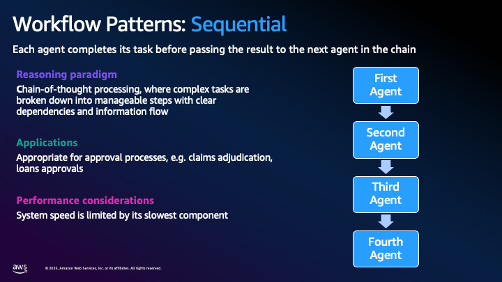
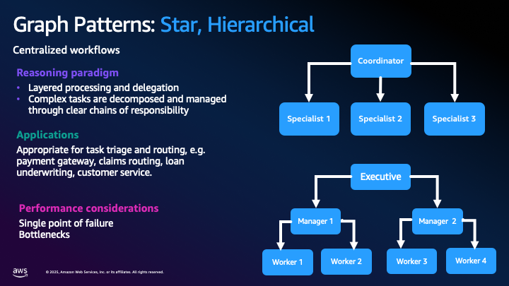
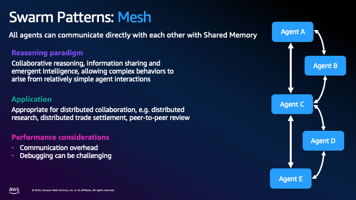
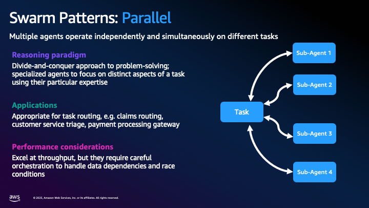
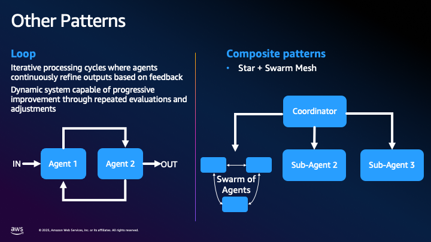
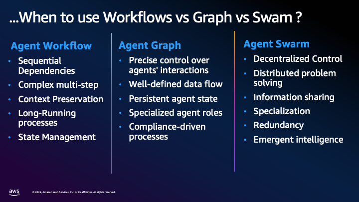

# Multi-Agent Coordination Patterns

Understanding different coordination patterns is crucial for designing effective multi-agent systems. Each pattern serves specific use cases and offers distinct advantages and trade-offs.

## 1. Sequential Workflow Patterns

**Architecture**: Each agent completes its task before passing the result to the next agent in the chain.

**Reasoning Paradigm**: Chain-of-thought processing, where complex tasks are broken down into manageable steps with clear dependencies and information flow.

**Applications**: Appropriate for approval processes, such as claims adjudication and loan approvals.

**Performance Considerations**: System speed is limited by its slowest component.

## 2. Hierarchical Graph Patterns (Star Pattern)

**Architecture**: Centralized workflows with clear chains of command and responsibility.

**Reasoning Paradigm**: Layered processing and delegation. Complex tasks are decomposed and managed through clear chains of responsibility.

**Applications**: Appropriate for task triage and routing, such as payment gateways, claims routing, loan underwriting, and customer service.

**Performance Considerations**: Risk of single point of failure and potential bottlenecks at coordination points.

## 3. Swarm Patterns: Mesh

**Architecture**: All agents can communicate directly with each other through shared memory.

**Reasoning Paradigm**: Collaborative reasoning, information sharing, and emergent intelligence, allowing complex behaviors to arise from relatively simple agent interactions.

**Applications**: Appropriate for distributed collaboration, such as distributed research, trade settlement, and peer-to-peer review.

**Performance Considerations**: Communication overhead and debugging challenges.

## 4. Swarm Patterns: Parallel

**Architecture**: Multiple agents operate independently and simultaneously on different tasks.

**Reasoning Paradigm**: Divide-and-conquer approach to problem-solving; specialized agents focus on distinct aspects using their particular expertise.

**Applications**: Appropriate for task routing, such as claims routing, customer service triage, and payment processing gateways.

**Performance Considerations**: Excel at throughput, but require careful orchestration to handle data dependencies and race conditions.

## 5. Loop and Composite Patterns

**Loop Patterns**: Iterative processing cycles where agents continuously refine outputs based on feedback. Dynamic system capable of progressive improvement through repeated evaluations and adjustments.

**Composite Patterns**: Hybrid architectures combining multiple coordination patterns within a single system, such as Star + Swarm Mesh combinations with coordinators managing sub-agents and swarms of agents working collaboratively.

## When to Choose Each Pattern

**1. Sequential Workflow Patterns** are the natural choice when your business process requires strict dependencies between stages, where each step must complete before the next can begin. These patterns excel in complex multi-step processes that demand context preservation throughout the entire workflow, making them ideal for scenarios like loan origination where customer information, credit checks, and approval decisions must flow seamlessly from one stage to the next. The sequential approach provides superior state management capabilities, allowing the system to maintain comprehensive audit trails and handle long-running processes that may span days or weeks. Consider this pattern when implementing compliance-heavy workflows such as regulatory reporting, where each step must be completed and verified before proceeding, or in sophisticated underwriting processes where risk assessment builds progressively through multiple validation layers.

**2. Hierarchical Graph Patterns (Star)** provide precise control over agent interactions through centralized coordination, making them the preferred choice when you need well-defined data flow with clear chains of command and responsibility. This pattern maintains persistent agent state across interactions while enabling specialized agent roles that can be easily managed and monitored from a central orchestrator. These patterns are particularly valuable in compliance-driven processes where regulatory requirements demand clear audit trails and controlled decision paths. Real-world applications include customer service systems where a central routing agent directs inquiries to specialized agents (billing, technical support, account management), payment processing gateways that coordinate between fraud detection, authorization, and settlement agents, and claims processing systems where a master agent orchestrates document collection, damage assessment, and approval workflows while maintaining complete oversight of the entire process.

**3. Swarm Patterns: Mesh** enable decentralized control through direct agent-to-agent communication, fostering distributed problem solving where multiple agents can share information freely and develop emergent intelligence through collaborative reasoning. This pattern promotes specialization with redundancy, where multiple agents may possess overlapping capabilities but contribute unique perspectives to complex problems. The mesh approach is particularly powerful when you need emergent intelligence requirements that arise from collective agent interactions rather than predetermined workflows. Consider mesh patterns for distributed research systems where financial analysts, market researchers, and risk assessors can dynamically share insights and build upon each other's findings, collaborative fraud detection networks where pattern recognition agents can immediately share suspicious activity indicators across the entire system, and investment committee simulations where portfolio managers, risk managers, and research analysts engage in free-form discussion to reach consensus on investment decisions.

**4. Swarm Patterns: Parallel** address high throughput requirements by enabling independent task processing across multiple agents simultaneously, providing optimal resource optimization for scalable workload distribution. This pattern excels in time-sensitive operations where multiple tasks can be processed concurrently without dependencies, maximizing system performance and minimizing latency. The parallel approach is ideal for high-volume transaction processing where thousands of payment authorizations can be evaluated simultaneously by specialized agents, document processing pipelines where contract analysis, risk assessment, and compliance checking can occur in parallel, and real-time market analysis where multiple agents can simultaneously monitor different sectors, asset classes, or geographic regions to provide comprehensive market intelligence. Development teams should choose this pattern when dealing with batch processing requirements, such as end-of-day reconciliation across multiple business units, or when implementing scalable customer onboarding systems that can process hundreds of applications simultaneously.

**5. Loop and Composite Patterns** serve iterative refinement needs through cycles of analysis, feedback, and improvement, making them essential for complex hybrid workflows that require adaptive system behaviors. These patterns support multi-stage processing requirements where initial results must be refined through multiple iterations, enabling sophisticated enterprise-scale orchestration that combines elements from other patterns. Loop patterns are particularly valuable for investment portfolio optimization where initial allocations are continuously refined based on market feedback and risk metrics, while composite patterns excel in comprehensive loan underwriting systems that combine sequential document processing, parallel risk assessments, and hierarchical approval workflows. Consider these patterns when implementing adaptive trading algorithms that learn from market responses and adjust strategies accordingly, multi-layered fraud detection systems that combine real-time parallel screening with iterative behavioral analysis, or enterprise-wide financial planning systems that orchestrate budget preparation across multiple departments through iterative refinement cycles guided by executive oversight and market constraints.

