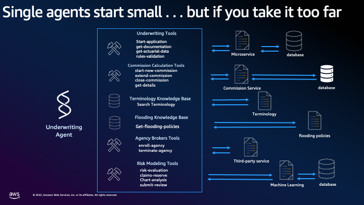
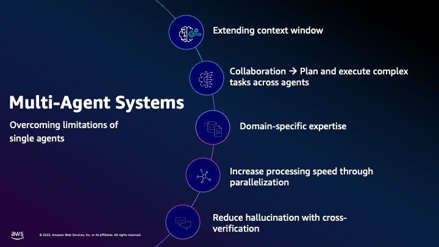

# Introduction to Agentic AI and Multi-Agent Systems

## What Are Agentic AI Systems?

Agentic AI represents a paradigm shift from traditional AI systems that simply respond to queries toward autonomous systems capable of independent reasoning, planning, and action-taking. Unlike conventional AI models that provide static responses, agentic systems can pursue goals, make decisions, and adapt their strategies based on environmental feedback ([Yudkowsky, 2008](https://intelligence.org/files/AIPosNegFactor.pdf); [Russell & Norvig, 2020](https://www.amazon.com/Artificial-Intelligence-A-Modern-Approach/dp/0134610997)).

The evolution of AI systems demonstrates increasing autonomy and business impact across four stages:

- **Generative AI Assistants**: Follow a set of rules, automate repetitive tasks (more human oversight)
- **Generative AI Agents**: Achieve singular goals, address broader range of tasks  
- **Agentic AI Systems**: Automate entire workflows, fully autonomous
- **Multi-Agent Systems**: Mimic human logic and reasoning (less human oversight)

The term "agent" in AI refers to any system that perceives its environment through sensors and acts upon that environment through actuators to achieve specified objectives ([Russell & Norvig, 2020](https://www.amazon.com/Artificial-Intelligence-A-Modern-Approach/dp/0134610997)). In the context of large language models and modern AI, agentic systems combine natural language understanding with the ability to use tools, maintain memory, and coordinate with other agents to accomplish complex tasks.

## The Evolution to Multi-Agent Architectures

Multi-agent systems (MAS) emerged from the recognition that complex real-world problems often exceed the capabilities of any single intelligent agent ([Stone & Veloso, 2000](https://www.cs.cmu.edu/~mmv/papers/MASsurvey.pdf); [Wooldridge, 2009](https://www.wiley.com/en-be/An+Introduction+to+MultiAgent+Systems%2C+2nd+Edition-p-9780470519462)). 

### Limitations of Single AI Agents

Single agents can start small and manageable, but as they scale to handle enterprise requirements, several critical limitations emerge:

**Technical Challenges:**
- **Coding Complexity**: Complex prompts required to limit hallucinations
- **Fragility**: Hard to maintain as systems grow
- **Tool Confusion**: Agents call wrong tools or pass incorrect arguments
- **Inconsistent Responses**: Reliability decreases with complexity

**Performance Issues:**
- **Slower Operation**: Frontier models needed for complex tasks
- **Increased Costs**: Prompt sizes grow exponentially  
- **Retry Overhead**: Agents frequently retry failed steps
- **Context Window Limits**: Context degradation syndrome

**Architectural Limitations:**
- **Lack of Collaboration**: No distributed problem solving capability
- **Single Task Execution**: No parallel task processing
- **No Specialization**: Single agent must handle all domains

### Multi-Agent Systems: Overcoming Single Agent Limitations

By distributing cognitive load across multiple specialized agents, multi-agent systems achieve several key advantages:

- **Domain-Specific Expertise**: Specialized agents optimized for specific functions ([Jennings, 2000](https://www.researchgate.net/publication/222661672_On_Agent-Based_Software_Engineering))
- **Increased Processing Speed**: Parallelization enables concurrent task execution ([Durfee & Lesser, 1991](https://www.researchgate.net/publication/2589926_Distributed_Problem_Solving_and_Planning))
- **Collaboration**: Agents plan and execute complex tasks together
- **Reduced Hallucination**: Cross-verification between agents improves accuracy
- **Extended Context Window**: Distributed memory and knowledge sharing
- **Fault Tolerance**: System resilience when individual agents fail ([Tambe, 1997](https://jair.org/index.php/jair/article/view/10193))
- **Emergent Intelligence**: Collective behavior exceeds individual capabilities ([Holland, 1992](https://direct.mit.edu/books/monograph/2574/Adaptation-in-Natural-and-Artificial-SystemsAn))

## Applications in Financial Services

Financial services present particularly compelling use cases for multi-agent systems due to their inherent complexity, regulatory requirements, and need for reliable automation. The industry's reliance on diverse data sources, time-sensitive decision-making, and risk management creates natural boundaries for agent specialization ([[Wellman et al., 2001](https://strategicreasoning.org/)]; [Tesfatsion, 2006](https://ideas.repec.org/h/eee/hecchp/2-16.html)).

Modern financial institutions are increasingly adopting agentic AI for applications ranging from algorithmic trading and risk assessment to customer service and regulatory compliance ([Chen et al., 2023](https://www.researchgate.net/publication/371304004_The_Impact_of_Artificial_Intelligence_on_the_Financial_Services_Industry); [Nakamura et al., 2024](https://www.citiwarrants.com/home/upload/citi_research/rsch_pdf_30305836.pdf)).

## Agent-to-Agent Protocol (A2A) with AWS Strands Agents

The AWS Strands Agents SDK provides robust support for Agent-to-Agent (A2A) communication, enabling seamless integration across organizational and technological boundaries. Key features include:

**Key Features**:
- **Standardized Communication**: Consistent protocols for agent interaction
- **Agent Discovery**: Via "Agent Cards" for dynamic agent identification
- **Flexible Interaction**: Adaptable communication patterns
- **Rich Data Exchange**: Complex data structure sharing
- **Enterprise-Ready**: Production-grade security and reliability

**Applications**:
- Multi-agent workflows
- Agent marketplaces
- Cross-platform integration  
- Distributed AI systems

