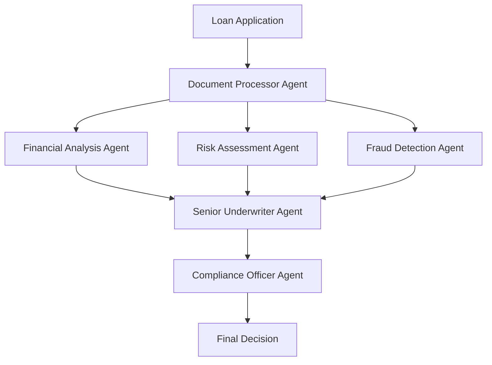

# Intelligent Loan Underwriting with Multi-Agent Systems

## Overview

This repository demonstrates how **agentic AI** revolutionizes the lending industry through intelligent multi-agent systems. By orchestrating specialized AI agents in hierarchical workflows, we can automate complex loan underwriting processes while maintaining the rigor and compliance requirements of financial services.

## 🏦 Why Agentic AI Transforms Lending

### For Borrowers
- **Faster Processing**: Loan decisions in hours instead of weeks
- **24/7 Availability**: Submit applications and get updates anytime
- **Transparent Process**: Clear visibility into application status and requirements
- **Reduced Friction**: Automated document processing eliminates repetitive paperwork
- **Consistent Experience**: Standardized evaluation criteria reduce bias and variability

### For Lenders
- **Operational Efficiency**: 70-90% reduction in manual underwriting time
- **Risk Mitigation**: Multi-layered analysis with specialized fraud detection
- **Regulatory Compliance**: Built-in compliance checks and audit trails
- **Scalability**: Handle volume spikes without proportional staff increases
- **Cost Reduction**: Lower operational costs per loan application
- **Quality Consistency**: Standardized decision-making processes

## 🏗️ System Architecture

### Core Components

#### 1. Multi-Agent Graph Framework (`graph.py`)
The foundation of our system implements three key topology patterns:

- **Star Topology**: Centralized coordination with specialist agents
- **Mesh Topology**: Collaborative peer-to-peer analysis
- **Hierarchical Topology**: Structured decision-making chains (primary for lending)

```python
# Example: Creating a hierarchical loan processing team
class HierarchicalLoanUnderwritingSystem:
    def __init__(self):
        self.senior_underwriter = Agent(role="senior_underwriter")
        self.financial_analyst = Agent(role="financial_analyst") 
        self.risk_assessor = Agent(role="risk_assessor")
        self.fraud_detector = Agent(role="fraud_detector")
```

#### 2. Intelligent Loan Processing (`IntelligentLoanApplication_Graph.py`)
Specialized implementation for loan underwriting with:

- **Document Processing Pipeline**: Automated extraction from PDFs
- **Hierarchical Agent Network**: Structured evaluation workflow
- **Decision Framework**: Comprehensive loan approval/denial logic
- **Compliance Integration**: Regulatory requirement validation

### Agent Specializations

| Agent Role | Primary Function | Key Capabilities |
|------------|------------------|------------------|
| **Senior Underwriter** | Final decision coordination | Policy interpretation, risk tolerance assessment |
| **Financial Analyst** | Income & asset verification | Cash flow analysis, debt-to-income calculations |
| **Risk Assessor** | Credit & market risk evaluation | Credit scoring, market condition analysis |
| **Fraud Detector** | Suspicious activity identification | Pattern recognition, anomaly detection |
| **Compliance Officer** | Regulatory adherence | Policy validation, documentation standards |

## 📋 Business Process Integration

### Traditional Loan Underwriting Challenges

1. **Manual Document Review**: Hours spent extracting data from PDFs
2. **Sequential Processing**: Bottlenecks when specialists are unavailable  
3. **Inconsistent Decisions**: Variation in human judgment
4. **Compliance Gaps**: Manual processes prone to oversight
5. **Limited Scalability**: Linear relationship between volume and staffing

### Agentic AI Solution



### Process Flow

1. **Document Ingestion**: AI agents automatically extract and categorize information from loan documents
2. **Parallel Analysis**: Multiple specialist agents simultaneously evaluate different aspects
3. **Risk Synthesis**: Senior underwriter agent consolidates findings using business rules
4. **Compliance Validation**: Automated regulatory compliance checks
5. **Decision Generation**: Structured decision with supporting rationale and audit trail

## 🚀 Getting Started

### Prerequisites

```bash
pip install -r requirements.txt
```

Key dependencies:
- `strands-agents`: Multi-agent framework
- `PyPDF2`: Document processing
- `boto3`: AWS integration for scalability

### Basic Usage

#### 1. Initialize the Loan Underwriting System

```python
from IntelligentLoanApplication_Graph import HierarchicalLoanUnderwritingSystem

# Create the multi-agent underwriting system
underwriting_system = HierarchicalLoanUnderwritingSystem()
```

#### 2. Process a Loan Application

```python
# Define loan documents
documents = {
    "application": "data/JoeDoeLoanApplication.pdf",
    "bank_statement": "data/JoeDoeBankStatement.pdf", 
    "credit_report": "data/JoeDoeCreditReport.pdf",
    "tax_returns": "data/JoeDoeTaxes.pdf",
    "pay_stub": "data/JoeDoePayStub.pdf"
}

# Process through multi-agent system
decision = underwriting_system.process_loan_application(
    applicant_name="Joe Doe",
    document_paths=documents,
    application_id="APP-2024-001"
)

print(f"Decision: {decision.decision}")
print(f"Confidence: {decision.confidence_score}")
print(f"Reasoning: {decision.reasoning}")
```

#### 3. Understanding Agent Interactions

```python
# View system status and agent activities
status = underwriting_system.get_system_status()
print(f"Active agents: {status['active_agents']}")
print(f"Processing queue: {status['queue_length']}")
```

## 📊 Sample Data

The `data/` directory contains realistic loan application documents:

- **Loan Applications**: Primary application forms
- **Financial Documents**: Bank statements, pay stubs, tax returns
- **Identity Verification**: ID documents and verification materials  
- **Credit Reports**: Credit history and scoring information
- **Property Information**: Real estate appraisals and documentation

## 🔍 Key Business Benefits

### Efficiency Gains

| Metric | Traditional Process | Agentic AI Process | Improvement |
|--------|-------------------|-------------------|-------------|
| **Processing Time** | 5-15 business days | 2-4 hours | 95% faster |
| **Document Review** | 2-4 hours manual | 5-10 minutes automated | 98% faster |
| **Error Rate** | 3-5% human error | <1% with validation | 80% reduction |
| **Compliance Checks** | Manual, inconsistent | Automated, comprehensive | 100% coverage |

### Risk Management

- **Multi-layered Analysis**: Specialized agents provide domain expertise
- **Fraud Detection**: Advanced pattern recognition beyond human capability
- **Consistency**: Standardized evaluation criteria eliminate subjective bias
- **Audit Trail**: Complete decision history for regulatory compliance

### Scalability

- **Volume Handling**: Process hundreds of applications simultaneously
- **Peak Management**: Auto-scale during high-demand periods
- **Geographic Expansion**: Deploy consistent processes across regions
- **Product Diversification**: Adapt agent specializations for different loan types

## 🎯 Use Cases

### 1. Mortgage Underwriting
- Complex property valuations
- Multi-document verification
- Regulatory compliance (TRID, QM rules)

### 2. Commercial Lending  
- Business financial analysis
- Industry risk assessment
- Collateral evaluation

### 3. Consumer Credit
- Personal loan evaluation
- Credit card applications
- Auto loan processing

## 🔧 Advanced Configuration

### Custom Agent Specializations

```python
# Create specialized agents for specific loan types
mortgage_specialist = Agent(
    role="mortgage_specialist",
    system_prompt="Expert in residential mortgage underwriting...",
    tools=["property_valuation", "title_search", "flood_zone_check"]
)
```

### Integration Points

- **Core Banking Systems**: API integration for account verification
- **Credit Bureaus**: Real-time credit report pulling
- **Property Databases**: Automated property valuation models
- **Regulatory Systems**: Compliance monitoring and reporting

## 📈 Performance Monitoring

Track key metrics:
- **Processing throughput**: Applications per hour
- **Decision accuracy**: Approval/denial precision
- **Compliance rate**: Regulatory adherence percentage
- **Customer satisfaction**: Application experience scores

## 🛡️ Security & Compliance

- **Data Encryption**: End-to-end encryption for sensitive financial data
- **Access Controls**: Role-based permissions for agent interactions
- **Audit Logging**: Complete transaction history for regulatory review
- **Privacy Protection**: GDPR/CCPA compliant data handling

## 🔮 Future Enhancements

- **Real-time Market Integration**: Dynamic risk adjustment based on economic conditions
- **Predictive Analytics**: Early warning systems for portfolio risk
- **Customer Communication**: Automated status updates and requirement notifications
- **Continuous Learning**: Agent performance optimization through feedback loops

## 📚 Educational Resources

### Understanding Multi-Agent Systems
- Review `LoanUnderwritingConcepts` class for theoretical foundations
- Explore topology patterns in `AgentGraphConcepts`
- Study agent specialization principles

### Business Process Mapping
- Analyze traditional vs. agentic workflows
- Understand regulatory compliance integration
- Review risk management frameworks

## 🤝 Contributing

This repository serves as an educational example of agentic AI in financial services. Key areas for exploration:

1. **Agent Specialization**: Develop new specialist agents for specific loan types
2. **Integration Patterns**: Connect with external financial data sources
3. **Compliance Frameworks**: Extend regulatory compliance capabilities
4. **Performance Optimization**: Enhance processing speed and accuracy

## 📄 License

Educational and demonstration purposes. Adapt for production use with appropriate security, compliance, and testing measures.

---

**Ready to revolutionize lending with agentic AI?** Start by exploring the code examples and understanding how multi-agent systems can transform your financial services operations.
